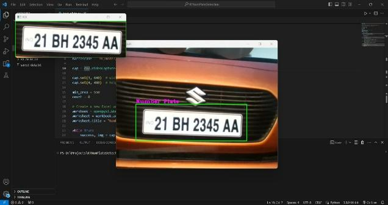

# Real-time-vehicle-plate-detection

This project involves real-time vehicle number plate detection using Python, OpenCV, Tesseract OCR, and OpenPyXL. The system employs computer vision techniques through OpenCV for image processing and feature extraction, while Tesseract OCR is utilized for optical character recognition on the detected number plates. The recognized plate information is then stored in an Excel workbook using OpenPyXL, enabling efficient data management. This integrated solution offers a practical approach to automate vehicle identification and data logging in real-time scenarios.


## Installation

Install python by downloading the official release.
(The version used for this project is 3.8)

Install pip,

For windows,
```bash
  curl https://bootst/rap.pypa.io/get-pip.py -o get-pip.py
```
```bash
  python get-pip.py
```
Now install the python dependencies,

```bash
  pip install opencv-python 
```
```bash
  pip install openpyxl
```
```bash
  pip install pytesseract
```

Download and Install Tesseract OCR Engine for windows,

```bash
  https://digi.bib.uni-mannheim.de/tesseract/
```
By default, the program will be installed in 
```bash
C:\Program Files\Tesseract-OCR
```

Add this to path using Edit environment variables.

Path to the Tesseract executable (change this to your Tesseract installation path in your python code)

By default it is, change it accordingly
```bash
pytesseract.pytesseract.tesseract_cmd = r'C:\Program Files\Tesseract-OCR\tesseract.exe'
```
Note ->  Make sure that you create a folder named "plates" in the main folder. That ensures to save the captured plates as img and excel format.

Thats it, Happy coding!
## 🔗 Links

[](https://www.linkedin.com/in/y-naga-vamsi)


